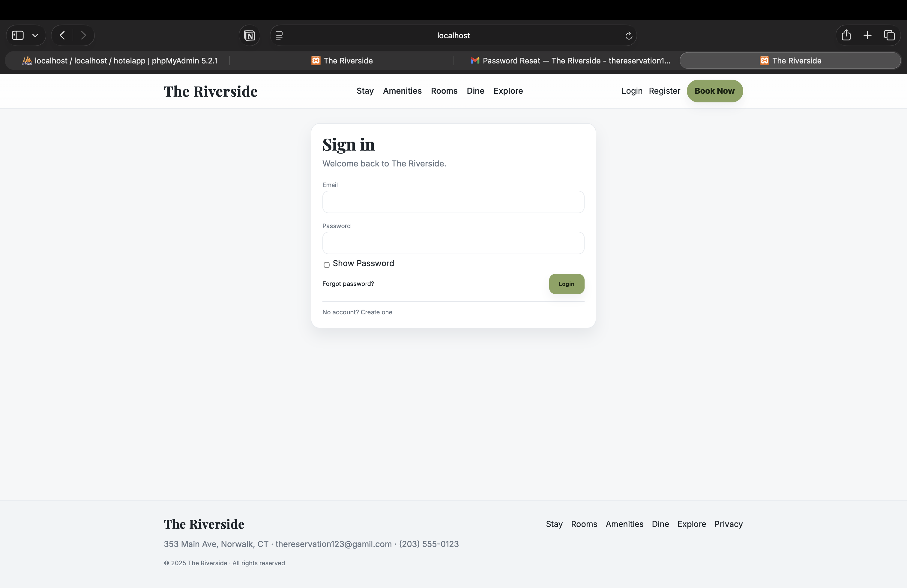
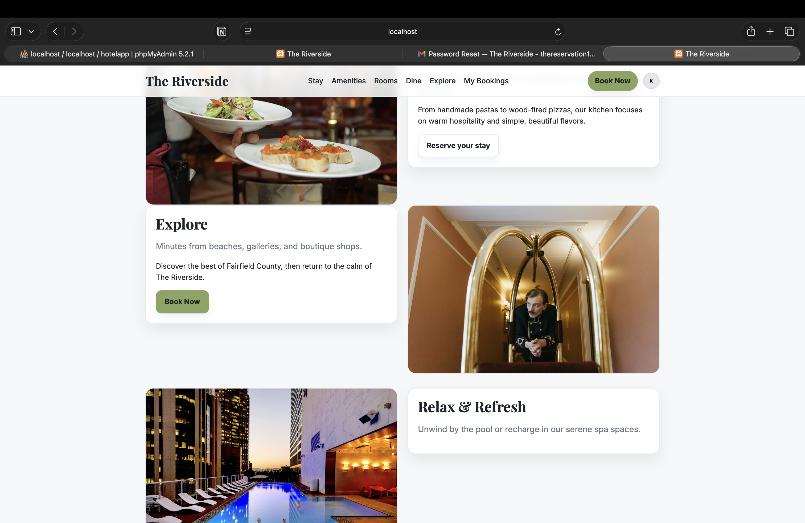
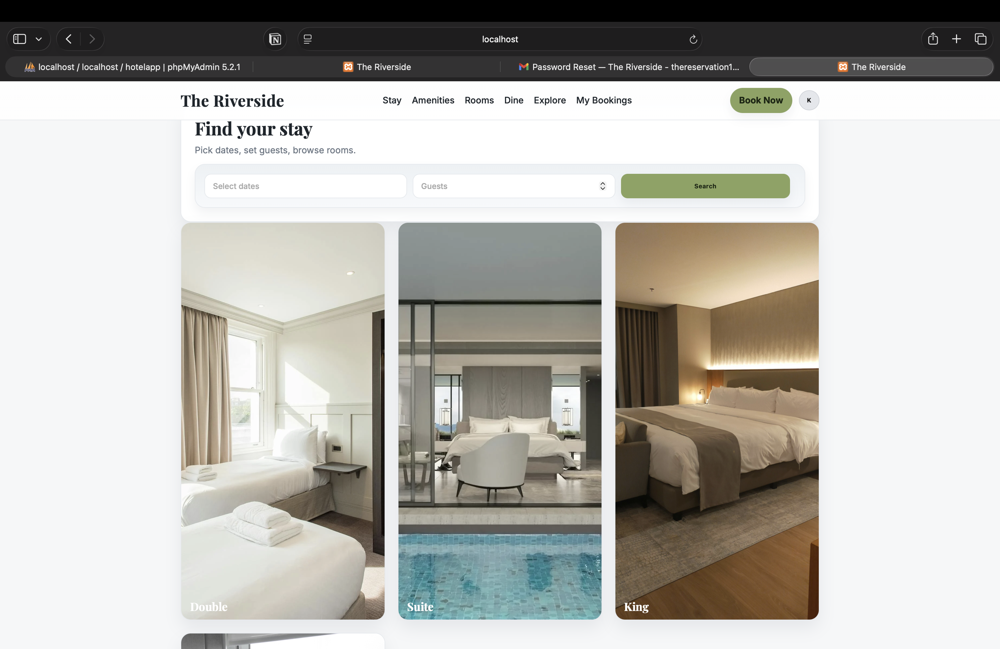
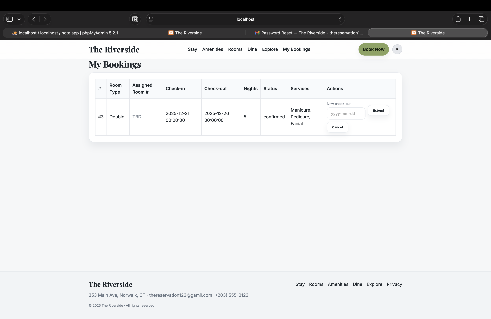
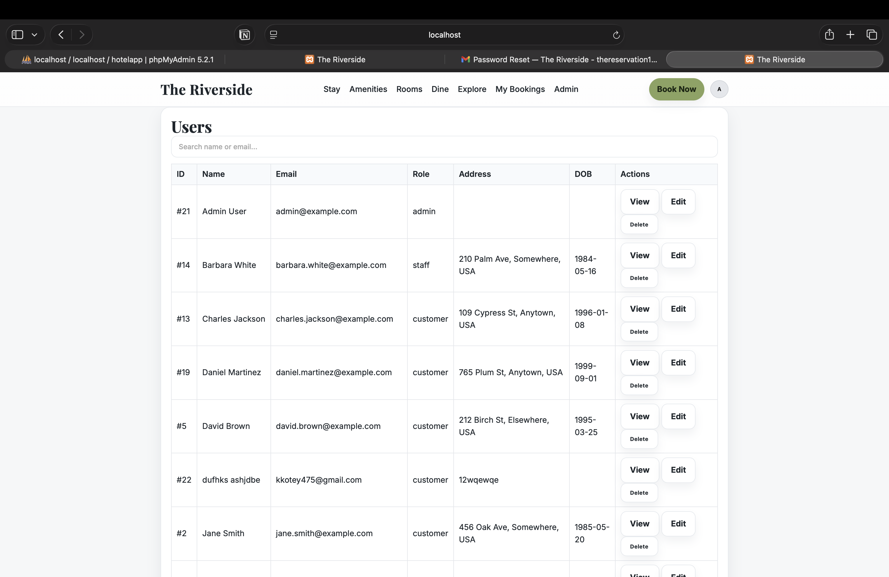
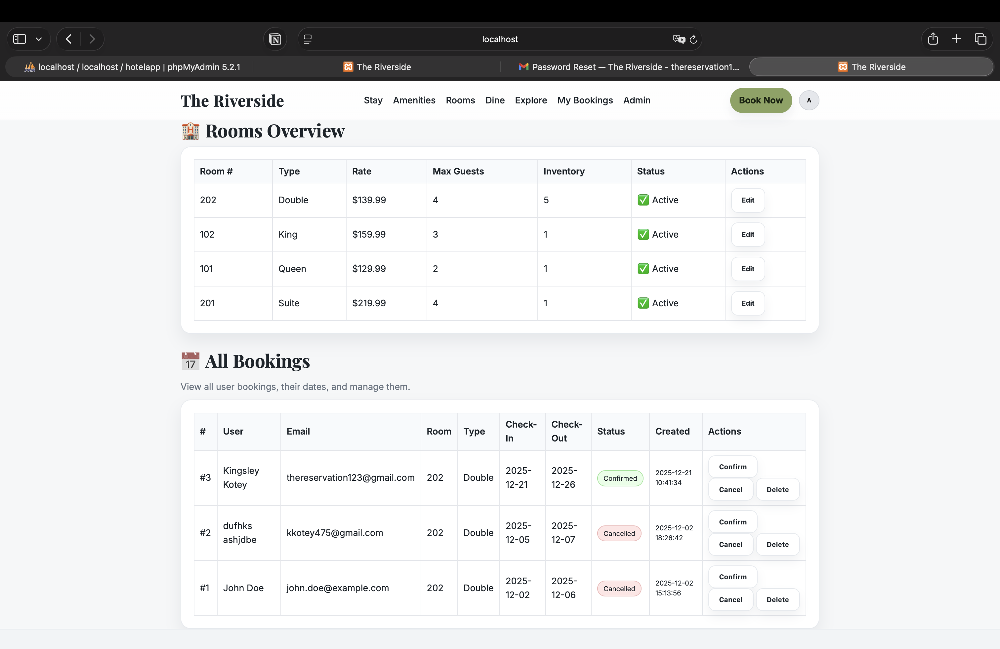

#  Hotel Management System

A full-stack hotel reservation and management system built with **PHP** and **MySQL**.  
Designed to streamline hotel operations with **multi-role authentication** for Guests, Staff, and Administrators.

---

##  Key Features

### Guest
- Secure registration and login
- Browse available rooms with pricing and amenities
- Book rooms with real-time availability
- View booking status (Pending / Confirmed)

### Staff
- View and manage incoming reservations
- Handle check-in and check-out workflows
- Access guest booking details for front-desk operations

### Admin
- Dashboard overview of system activity
- Manage room inventory (add, edit, delete, pricing)
- Approve, ban, or manage user accounts
- Configure system-wide settings

---

## Tech Stack
- **Backend:** PHP (Core)
- **Database:** MySQL
- **Frontend:** HTML5, CSS3, JavaScript
- **Email:** PHPMailer
- **Server:** Apache (XAMPP for local development)
- **Dependency Management:** Composer

---

## Screenshots

### Login



### My Bookings



### Admin Dashboard



### Admin Users



### Find Your Stay



### Explore



---

##  Local Setup

### 1) Clone the repository
```bash
git clone https://github.com/kkotey14/hotel-management-system.git
cd hotel-management-system
